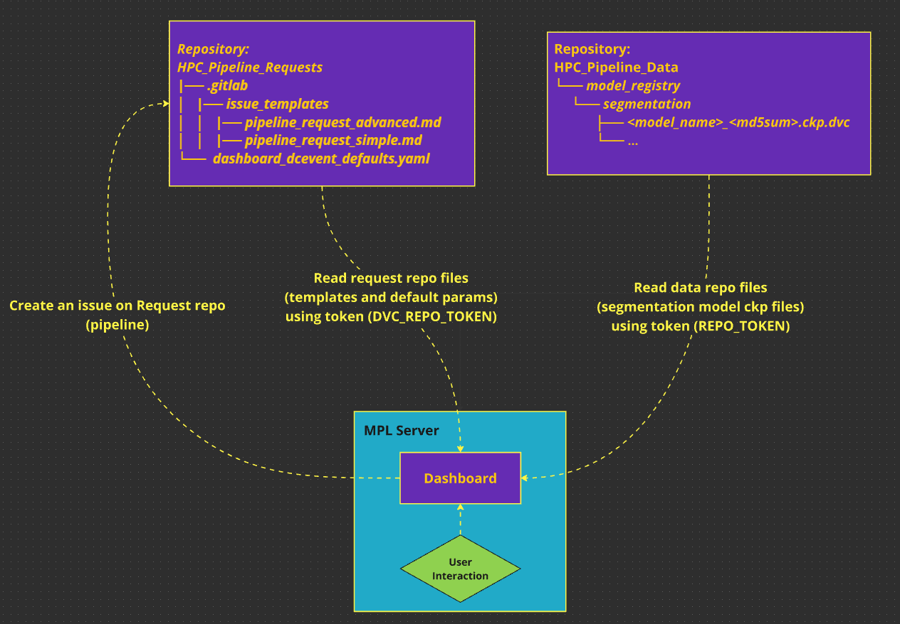

# HPC_Pipeline_Dashboard

A web interface to create data processing pipelines on HPC.


## Main

[](https://github.com/RaghavaAlajangi/hpc_pipeline_dashboard/actions/workflows/ci.yml)_
[](https://codecov.io/gh/RaghavaAlajangi/hpc_pipeline_dashboard)_


## Overview:



## 1. Local usage:
### Clone the repo

```bash
git clone git@gitlab.gwdg.de:blood_data_analysis/hpc_pipeline_dashboard.git
```
### Create a `.env` file with the following (GIT ignores this file)
```bash
# GWDG GitLab URL
REPO_URL="https://gitlab.gwdg.de"

# Request repo creds
REPO_TOKEN=<paste your request repo token>
PROJECT_NUM=<paste your project number>

# DVC repo creds
DVC_REPO_TOKEN=<paste your DVC repo token>
DVC_REPO_PROJECT_NUM=<paste your project number>
```
### Run the below command (develop/debug)
```bash
python -m dashboard --local

# Then open the http://127.0.0.1:8050/local-dashboard
```

## 2. Deployment:

### I. Prerequisites

- Make sure you have `Docker Desktop` installed on your computer.
- To install, go to [Official Docker page](https://docs.docker.com/get-docker/).
  This step might require administrative rights.
- Contact IT to have a developer account
  on [MPL harbor](https://harbor.intranet.mpl.mpg.de/) for deployment
- Since `.env` file is local, we have to provide IT with all the credentials 
  that are mentioned in the `.env` file.


### II. Build ``Dashboard`` and ``Cron`` docker images:

- Open `command prompt` in administrative mode
- Check weather you have ``Docker`` installed or not
- Change directory: ``cd <path/to/repo>``<br><br>
- Run the below command to create a Docker image for the ``dashboard`` 
```bash
docker build -t hpc-pipeline-dashboard.
```
- Run the below command to create a Docker image for the ``cron job`` 
```bash
docker build -t hpc-pipeline-dashboard-cron --target cron .
```

### III. Test Docker images locally
- Open the command prompt in administrative mode, run the command below.

```bash
# Replace `GITLAB_URL`, `REPO_TOKEN`, `PROJECT_NUMNER`, `DVC_REPO_TOKEN`, and
# `DVC_REPO_PROJECT_NUM` with actual secrets

# Windows command prompt:

docker run -p 8050:8050 ^
-e REPO_URL=<GITLAB_URL> ^
-e REPO_TOKEN=<REPO_TOKEN> ^
-e PROJECT_NUM=<PROJECT_NUMNER> ^
-e DVC_REPO_TOKEN=<DVC_REPO_TOKEN> ^
-e DVC_REPO_PROJECT_NUM=<DVC_REPO_PROJECT_NUM> ^
-e BASENAME_PREFIX="/hpc-pipeline-dashboard/" ^
 hpc-pipeline-dashboard
 
 # Bash command prompt
 
 docker run -p 8050:8050 \
-e REPO_URL=<GITLAB_URL> \
-e REPO_TOKEN=<REPO_TOKEN> \
-e PROJECT_NUM=<PROJECT_NUMNER> \
-e DVC_REPO_TOKEN=<DVC_REPO_TOKEN> \
-e DVC_REPO_PROJECT_NUM=<DVC_REPO_PROJECT_NUM> \
-e BASENAME_PREFIX="/hpc-pipeline-dashboard/" \
 hpc-pipeline-dashboard
```

- Open the browser and try reaching the following
  address. http://localhost:8050/hpc-pipeline-dashboard/. This should start the
  app.
- If the container runs properly, the changes can be pushed to the MPL harbour for deployment.
- Look up for running container ID and stop it.

```bash
docker ps -a

docker stop <containerID>
```
### IV. Make sure you set the environment variables on the MPL server:

- Hand over the environment variables to the IT to set them up as environment variables 
variables on the MPL server (this is already done)
- You don't have to do this every time, but keep in mind that if the dashboard crashes 
Because of access tokens, create new tokens and hand them over to the IT.


### V. Get Git latest commit ID:
- Git last commit ID (sort form)
```bash
git rev-parse --short HEAD
```


### VI. Log in to MPL Harbor Intranet using your developer credentials:

```bash
docker login harbor.intranet.mpl.mpg.de
```

### VII. Tag & Push new Docker images to the MPL server:

#### a. Dashboard Image (tag & push)
- Tag both your commit and latest versions:
```bash
# Tag commit
docker tag hpc-pipeline-dashboard harbor.intranet.mpl.mpg.de/guck-tools/hpc-pipeline-dashboard:yourcommitID

# Tag latest
docker tag hpc-pipeline-dashboard harbor.intranet.mpl.mpg.de/guck-tools/hpc-pipeline-dashboard:latest
```
- Push both your commit and latest versions:

```bash
# Tag commit
docker push harbor.intranet.mpl.mpg.de/guck-tools/hpc-pipeline-dashboard:yourcommitID

# Tag latest
docker push harbor.intranet.mpl.mpg.de/guck-tools/hpc-pipeline-dashboard:latest
```

#### b. Cron Image (tag & push)
- Tag both your commit and latest versions:
```bash
# Tag commit
docker tag hpc-pipeline-dashboard-cron harbor.intranet.mpl.mpg.de/guck-tools/hpc-pipeline-dashboard-cron:yourcommitID

# Tag latest
docker tag hpc-pipeline-dashboard-cron harbor.intranet.mpl.mpg.de/guck-tools/hpc-pipeline-dashboard-cron:latest
```
- Push both your commit and latest versions:
```bash
# Tag commit
docker push harbor.intranet.mpl.mpg.de/guck-tools/hpc-pipeline-dashboard-cron:yourcommitID

# Tag latest
docker push harbor.intranet.mpl.mpg.de/guck-tools/hpc-pipeline-dashboard-cron:latest
```

## Useful Docker commands

```bash
# To see the created Docker images
docker images

# To see running containers
docker ps -a

# Run an image
docker run <image_name>

#Stop container
docker stop <container_ID>

# Get into the image and test whether it is created properly.
docker run -it <image_name> /bin/bash

# Get into the running container and test whether it is running properly.
docker exec -it <container_ID> /bin/bash
```
